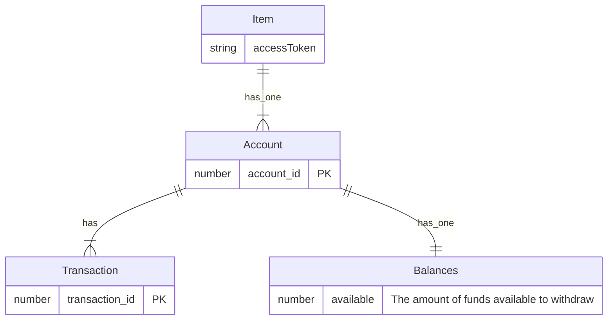

# Teller.sh 💸

An email service for money management

## Getting Started

```sh
pnpm i && pnpm dev
```



# Data Models

## Accounts

### `account_id`

Unique ID for the account. This value will not change unless, for example, the name of the account changes. If this happens a new `account_id` will be assigned to the account. The `account_id` can also change if the `access_token` is deleted and the same credentials that were used to generate that `access_token` are used to generate a new `access_token` on a later date. In that case, the new `account_id` will be different from the old `account_id`. If an account with a specific `account_id` disappears instead of changing, the account is likely closed. Closed accounts are not returned by the Plaid API.

### `balances`

#### `available`

The amount of funds available to be withdrawn from the account, as determined by the financial institution. For credit cards, this is typically the credit limit minus the current balance, minus any pending outflows/inflows. For checking/savings accounts, this is typically the current balance minus any pending outflows, plus any pending inflows. For checking/savings account, this balance does not include the overdraft limit. **Note that not all institutions calculate the available balance, so this might be null.**

#### `current`

Total funds in/owed by the account. Balance information may be cached unless the value was returned by /accounts/balance/get; if the Item is enabled for Transactions, the balance will be at least as recent as the most recent Transaction update. If you require realtime balance information, use the available balance as provided by /accounts/balance/get.

#### `iso_currency_code`

The ISO-4217 currency code of the balance. Always null if unofficial_currency_code is non-null.

#### `limit`

For credit-type accounts, this represents the credit limit. For depository-type accounts, this represents the pre-arranged overdraft limit, which is common for current (checking) accounts in Europe. In North America, this field is typically only available for credit-type accounts.

#### `unofficial_currency_code`

The unofficial currency code associated with the balance. Always null if iso_currency_code is non-null. Unofficial currency codes are used for currencies that do not have official ISO currency codes, such as cryptocurrencies and the currencies of certain countries.

### `mask`

The mask may be non-unique between an Item's accounts, and it may also not match the mask that the bank displays to the user.

### `name`

The name of the account, either assigned by the user or by the financial institution itself

### `official_name`

The official name of the account as given by the financial institution

### `persistent_account_id`

### `subtype`

### `type`

https://mermaid.live/edit#pako:eNp1UcFugzAM_RXLZ6iUltI1t027TZMmrafBNBkSRjRIUAjrOuDfF2DSVql1Dknes5-f7B5zIyRylPZe0bulOtXgo0lu89x02r1CvyBT6K7OpAVaqDcl4OkBUvRnThmXyyUHS7ql3CmjL9W7P_qaRpbcUUU6l-1FA5-kKsoq6QsPpQSqJz9gCig6Ldp_vDNwVK4Ulo4pwlmLBoYhDIceHHAoqT1DB8gWFAOspa1JCT-k2UmKrpS1TJH7pyD7MVkffR51zjyfdI7c2U4G2DWCnPwdK_KCqtajDWnkPX4hZ9vV3sduvWYxY_FmFwV4Qh7GqzWLdnv_j9hmG0c3Y4DfxngJFqAUyhn7uCxt3t0s-TLzU9_xBwqdkM8
